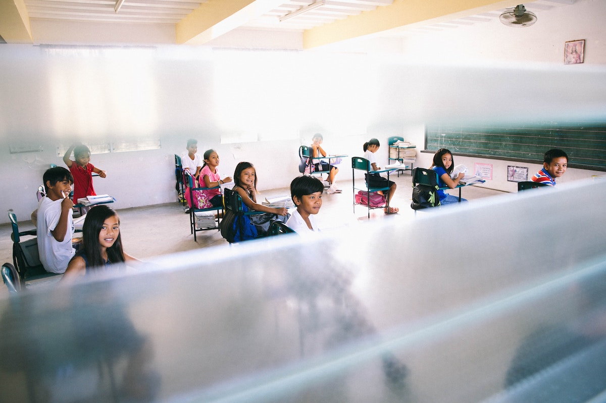

```{r setup, include=FALSE}
usethis::use_git_ignore(c("*.csv", "*.rds"))
options(htmltools.dir.version = FALSE)

library(knitr)
library(tidyverse)
library(xaringan)
library(fontawesome)
```

class: inverse, center, middle

# `r fa("fas fa-images", fill = "#fff")`

**View the slides:** 

[bretsw.com/edvolution24](https://bretsw.com/edvolution24/)

---

class: inverse, center, middle

# `r fa("fas fa-mountain-sun", fill = "#fff")` <br><br> Performance <br> as a Journey

---

# `r fa("fas fa-mountain-sun", fill = "#fff")` Performance as a Journey

```{r, out.width = "300px", echo = FALSE, fig.align = "center"}
include_graphics("img/SDL.png")
```

--

### Self-Directed Learning is **Purposeful**:

--

- `r fa("far fa-circle-dot", fill = "#782F40")` Performance Objective

--

- `r fa("fas fa-house-user", fill = "#782F40")` Starting Context

--

- `r fa("fas fa-cubes-stacked", fill = "#782F40")` Evaluation

--

<hr>

### Self-Directed Learning is **Autonomous**:

--

- `r fa("fas fa-person-walking", fill = "#782F40")` Exploration and Practice

--

- `r fa("fas fa-people-arrows", fill = "#782F40")` External Guides

--

- `r fa("fas fa-gauge-high", fill = "#782F40")` Difficulty Level


---

class: inverse, center, middle

# Self-Directed Learning is <br> *Purposeful*


---

class: inverse, center, middle

# `r fa("far fa-circle-dot", fill = "#fff")`  <br><br> 1. Performance Objective

---

# `r fa("far fa-circle-dot", fill = "#fff")` 1. Performance Objective

```{r, out.width = "720px", echo = FALSE, fig.align = "center"}
include_graphics("img/1-mountain-summit.png")
```

--

### Where to? Into the New

--

- **New Tasks:** Emerging technologies, such as Generative AI applications for teaching and learning

---

# `r fa("far fa-circle-dot", fill = "#fff")` 1. Performance Objective

```{r, out.width = "720px", echo = FALSE, fig.align = "center"}
include_graphics("img/1-mountain-summit.png")
```

### Where to? Into the New

- **New Jobs:** beginning teachers entering the profession, transitioning from classroom to leadership position

---

# `r fa("far fa-circle-dot", fill = "#fff")` 1. Performance Objective

```{r, out.width = "720px", echo = FALSE, fig.align = "center"}
include_graphics("img/1-mountain-summit.png")
```

### Where to? Into the New

- **New Contexts:** COVID-19 pandemic disruptions, new policies, new school

---

class: inverse, center, top

# `r fa("far fa-circle-dot", fill = "#fff")` <br><br> 1. Performance Objective <br><br> `r fa("fas fa-person-falling", fill = "#fff")` Peril

---

class: inverse, center, top

# `r fa("far fa-circle-dot", fill = "#fff")` <br><br> 1. Performance Objective <br><br> `r fa("fas fa-person-falling", fill = "#fff")` Peril (watch out!)

<hr>

--

**Lack of intentionality `r fa("fas fa-arrows-left-right", fill = "#fff")` Analysis paralysis**

<hr>

--

`r fa("fas fa-person-falling", fill = "#fff")` Unclear goals: lack of direction

--

`r fa("fas fa-person-falling", fill = "#fff")` Too many options: Trouble getting started


---

class: inverse, center, middle

# `r fa("fas fa-house-user", fill = "#fff")` <br><br> 2. Starting Context

---

# `r fa("fas fa-house-user", fill = "#fff")` 2. Starting Context

```{r, out.width = "720px", echo = FALSE, fig.align = "center"}
include_graphics("img/2-character-builder.png")
```

--

### From where? Start from strength

--

- Deep roots in backstory, experiences, and people back home

---

# `r fa("fas fa-house-user", fill = "#fff")` 2. Starting Context

```{r, out.width = "720px", echo = FALSE, fig.align = "center"}
include_graphics("img/2-character-builder.png")
```

### From where? Start from strength

- Character builder: Knowledge, skills, and attitudes/abilities (KSAs)

---

# `r fa("fas fa-house-user", fill = "#fff")` 2. Starting Context

```{r, out.width = "720px", echo = FALSE, fig.align = "center"}
include_graphics("img/2-character-builder.png")
```

### From where? Start from strength

- Reasons for wanting to be an educator
- Favorite teachers growing up

---

class: inverse, center, top

# `r fa("fas fa-house-user", fill = "#fff")` <br><br> 2. Starting Context <br><br> `r fa("fas fa-person-falling", fill = "#fff")` Peril (watch out!)

<hr>

--

**Too little self `r fa("fas fa-arrows-left-right", fill = "#fff")` Too much self**

<hr>

--

`r fa("fas fa-person-falling", fill = "#fff")` Social comparison and lack of confidence in strengths

--

`r fa("fas fa-person-falling", fill = "#fff")` Over-confidence


---

class: inverse, center, middle

# `r fa("fas fa-cubes-stacked", fill = "#fff")` <br><br> 3. Evaluation

---

# `r fa("fas fa-cubes-stacked", fill = "#fff")` 3. Evaluation

```{r, out.width = "720px", echo = FALSE, fig.align = "center"}

```

--

### How well? Knowing whether you made it

--

- 360° review: **External**&#151;key performance indicators (KPIs) and metrics

---

# `r fa("fas fa-cubes-stacked", fill = "#fff")` 3. Evaluation

```{r, out.width = "720px", echo = FALSE, fig.align = "center"}

```

### How well? Knowing whether you made it

- 360° review: **Internal**&#151;self-reflection

---

# `r fa("fas fa-cubes-stacked", fill = "#fff")` 3. Evaluation

```{r, out.width = "720px", echo = FALSE, fig.align = "center"}

```

### How well? Knowing whether you made it

- 360° review: **Horizontal**&#151;peer-review

---

# `r fa("fas fa-cubes-stacked", fill = "#fff")` 3. Evaluation

```{r, out.width = "720px", echo = FALSE, fig.align = "center"}

```

### How well? Knowing whether you made it

- 360° review: **Vertical**&#151;supervisory evaluation and supervisee feedback

---

class: inverse, center, top

# `r fa("fas fa-cubes-stacked", fill = "#fff")` <br><br> 3. Evaluation <br><br> `r fa("fas fa-person-falling", fill = "#fff")` Peril (watch out!)

<hr>

--

**Skip ahead `r fa("fas fa-arrows-left-right", fill = "#fff")` Stuck in analysis**

<hr>

--

`r fa("fas fa-person-falling", fill = "#fff")` Immediately move on to next tasks with no time spent on evaluation 

--

`r fa("fas fa-person-falling", fill = "#fff")` Never get to the next tasks because perpetually cycling through evaluation


---

class: inverse, center, middle

# Self-Directed Learning is <br> *Autonomous*


---

class: inverse, center, middle

# `r fa("fas fa-person-walking", fill = "#fff")` <br><br> 4. Exploration and Practice

---

# `r fa("fas fa-person-walking", fill = "#fff")` 4. Exploration and Practice

```{r, out.width = "720px", echo = FALSE, fig.align = "center"}
include_graphics("img/4-journey-space.png")
```

--

### What path? Opportunities to try things and adjust

--

- For teachers, the development of **Pedagogical Content Knowledge (PCK)**

---

# `r fa("fas fa-person-walking", fill = "#fff")` 4. Exploration and Practice

```{r, out.width = "540px", echo = FALSE, fig.align = "center"}

```

**Pedagogical knowledge:** *How* to teach

--

- deepening understanding

--

- practicing skills

--

- reviewing concepts

---

# `r fa("fas fa-person-walking", fill = "#fff")` 4. Exploration and Practice

```{r, out.width = "540px", echo = FALSE, fig.align = "center"}
include_graphics("img/idea.jpg")
```

**Content knowledge:** *What* to teach

--

- getting ideas and inspiration

--

- staying up-to-date on news and topics

--

- giving students different perspectives

---

class: inverse, center, top

# `r fa("fas fa-person-walking", fill = "#fff")` <br><br> 4. Exploration and Practice<br><br> `r fa("fas fa-person-falling", fill = "#fff")` Peril (watch out!)

<hr>

--

**Too little motivation `r fa("fas fa-arrows-left-right", fill = "#fff")` Too much motivation**

<hr>

--

`r fa("fas fa-person-falling", fill = "#fff")` Lack of follow through

--

`r fa("fas fa-person-falling", fill = "#fff")` Always connected to work

--

`r fa("fas fa-person-falling", fill = "#fff")` Context collapse: No distinction between personal and professional


---

class: inverse, center, middle

# `r fa("fas fa-people-arrows", fill = "#fff")` <br><br> 5. External Guides

---

# `r fa("fas fa-people-arrows", fill = "#fff")` 5. External Guides

```{r, out.width = "720px", echo = FALSE, fig.align = "center"}
include_graphics("img/5-guide-space.png")
```

--

### With whom? Help from other people and resources

---

# `r fa("fas fa-people-arrows", fill = "#fff")` 5. External Guides

```{r, out.width = "540px", echo = FALSE, fig.align = "center"}
include_graphics("img/social-media.jpg")
```

### With whom? Help from other people and resources

**Learning Ecosystem:**

--

- Many spaces where beginning teachers can search and connect

--

- From school colleagues to social media connections

---

class: inverse, center, middle

# `r fa("fas fa-quote-left", fill = "#fff")` 

"I wish there was a way to use social media like, 'Here's a problem I'm dealing with; can people help me with this problem?'" 

~ Julie

---

class: inverse, center, middle

# `r fa("fas fa-quote-left", fill = "#fff")` 

"I appreciate the perspective of being able to see what other teachers are dealing with in their district or their state like, 'Are you, are you experiencing these same things?' And they are, and it’s nice to know that you’re not the only one." 

~ Simone

---

class: inverse, center, top

# `r fa("fas fa-people-arrows", fill = "#fff")` <br><br> 5. External Guides <br><br> `r fa("fas fa-person-falling", fill = "#fff")` Peril (watch out!)

<hr>

--

**Too dependent `r fa("fas fa-arrows-left-right", fill = "#fff")` Too independent**

<hr>

--

`r fa("fas fa-person-falling", fill = "#fff")` Over-reliant on others

--

`r fa("fas fa-person-falling", fill = "#fff")` Lack of agency and self-determination of priorities

--

`r fa("fas fa-person-falling", fill = "#fff")` Don't know what you don't know

--

`r fa("fas fa-person-falling", fill = "#fff")` Get stuck


---

class: inverse, center, middle

# `r fa("fas fa-gauge-high", fill = "#fff")` <br><br> 6. Difficulty Level

---

# `r fa("fas fa-gauge-high", fill = "#fff")` 6. Difficulty Level

```{r, out.width = "720px", echo = FALSE, fig.align = "center"}

```

--

### How hard? Finding the right balance

--

- Self-awareness, self-regulation, self-management, self-discipline

---

# `r fa("fas fa-gauge-high", fill = "#fff")` 6. Difficulty Level

```{r, out.width = "720px", echo = FALSE, fig.align = "center"}

```

--

### How hard? Finding the right balance

- Zone of Proximal Development

---

class: inverse, center, top

# `r fa("fas fa-gauge-high", fill = "#fff")` <br><br> 6. Difficulty Level <br><br> `r fa("fas fa-person-falling", fill = "#fff")` Peril (watch out!)

<hr>

--

**Too easy `r fa("fas fa-arrows-left-right", fill = "#fff")` Too hard**

<hr>

--

`r fa("fas fa-person-falling", fill = "#fff")` Boredom

--

`r fa("fas fa-person-falling", fill = "#fff")` Frustration


---

class: inverse, center, middle

# `r fa("fas fa-mountain-sun", fill = "#fff")` <br><br> Performance <br> as a Journey

---

# `r fa("fas fa-mountain-sun", fill = "#fff")` Performance as a Journey

```{r, out.width = "300px", echo = FALSE, fig.align = "center"}
include_graphics("img/SDL.png")
```

### Self-Directed Learning is **Purposeful**:

- `r fa("far fa-circle-dot", fill = "#782F40")` Performance Objective

- `r fa("fas fa-house-user", fill = "#782F40")` Starting Context

- `r fa("fas fa-cubes-stacked", fill = "#782F40")` Evaluation

--

<hr>

### Self-Directed Learning is **Autonomous**:

- `r fa("fas fa-person-walking", fill = "#782F40")` Exploration and Practice

- `r fa("fas fa-people-arrows", fill = "#782F40")` External Guides

- `r fa("fas fa-gauge-high", fill = "#782F40")` Difficulty Level

---

# `r fa("fas fa-mountain-sun", fill = "#fff")` Performance as a Journey

```{r, out.width = "300px", echo = FALSE, fig.align = "center"}
include_graphics("img/SDL.png")
```

### Self-Directed Learning is **Purposeful**:

- `r fa("far fa-circle-dot", fill = "#782F40")` Performance Objective: **Where to?**

- `r fa("fas fa-house-user", fill = "#782F40")` Starting Context: **From where?**

- `r fa("fas fa-cubes-stacked", fill = "#782F40")` Evaluation: **How well?**

<hr>

### Self-Directed Learning is **Autonomous**:

- `r fa("fas fa-person-walking", fill = "#782F40")` Exploration and Practice: **What path?**

- `r fa("fas fa-people-arrows", fill = "#782F40")` External Guides: **With whom?**

- `r fa("fas fa-gauge-high", fill = "#782F40")` Difficulty Level: **How hard?**

---

# `r fa("fas fa-mountain-sun", fill = "#fff")` Performance as a Journey

```{r, out.width = "640px", echo = FALSE, fig.align = "center"}
include_graphics("img/SDL.png")
```

### Next Steps: 

--

- What will you remember tomorrow? 

--

- What will you put into practice?

--

- How might self-directed learning help you navigate change and innovation?


---

class: inverse, center, middle

# `r fa("fas fa-question", fill = "#fff")` <br><br> Questions

**What would you like to know more about?**

<hr>

<br><br><br>

`r fa("fas fa-images", fill = "#fff")` **Today's Slides: [bretsw.com/edvolution24](https://bretsw.com/edvolution24/)**

<br><br><br>
<hr>

**Bret Staudt Willet** | Florida State University

`r fa("fas fa-envelope", fill = "#fff")` [bret.staudtwillet@fsu.edu](mailto:bret.staudtwillet@fsu.edu) | `r fa("fas fa-globe", fill = "#fff")` [bretsw.com](https://bretsw.com) | `r fa("fab fa-github", fill = "#fff")` [GitHub](https://github.com/bretsw/)

---

# `r fa("fas fa-book-open", fill = "#fff")` Resources

Auletto, A. (2021). Making sense of early-career teacher support, satisfaction, and commitment. *Teaching and Teacher Education, 102*, 103321. https://doi.org/10.1016/j.tate.2021.103321

Beach, P. (2017). Self-directed online learning: A theoretical model for understanding elementary teachers’ online learning experiences. *Teaching and Teacher Education, 61*, 60–72. https://doi.org/10.1016/j.tate.2016.10.007

Fox, A. & Bird, T. (2017). The challenge to professionals of using social media: Teachers in England negotiating personal-professional identities. *Education and Information Technologies, 22*(2), 647–675. https://doi.org/10.1007/s10639- 015-9442-0 

Francom, G. M. (2010). *International Journal of Self-Directed Learning, 7*(1), 29–44. https://www.oltraining.com/SDLwebsite/IJSDL/IJSDL7.1-2010.pdf#page=34

Keay, J. K., Carse, N., & Jess, M. (2019). Understanding teachers as complex professional learners. *Professional Development in Education, 45*(1), 125–137. https://doi.org/10.1080/19415257.2018.1449004

Knowles, M. S. (1975). *Self-directed learning: A guide for learners and teachers*. Pearson Learning.

---

# `r fa("fas fa-book-open", fill = "#fff")` Resources

Ladson-Billings, G. (1995). Toward a theory of culturally relevant pedagogy. *American Educational Research Journal, 32*, 465−491. https://doi.org/10.3102/00028312032003465

Louws, M. L., Meirink, J. A., van Veen, K., & van Driel, J. H. (2017). Teachers' self- directed learning and teaching experience: What, how, and why teachers want to learn. *Teaching and Teacher Education, 66*, 171–183. https://doi.org/10.1016/j.tate.2017.04.004

Macià, M.,& García, I. (2016). Informal online communities and networks as a source of teacher professional development: A review. *Teaching and Teacher Education, 55*, 291–307. https://doi.org/10.1016/j.tate.2016.01.021

Meredith, T. R. (2016). Game-based learning in professional development for practicing educators: A review of the literature. *TechTrends, 60*, 496–502. https://doi.org/10.1007/s11528-016-0107-7

McChesney, K., & Aldridge, J. M. (2021). What gets in the way? A new conceptual model for the trajectory from teacher professional development to impact. *Professional Development in Education, 47*(5), 834–852. https://doi.org/10.1080/19415257.2019.1667412

---

# `r fa("fas fa-book-open", fill = "#fff")` Resources

Paris, D. (2012). Culturally sustaining pedagogy: A needed change in stance, terminology, and practice. *Educational Researcher, 41*(3), 93–97. https://doi.org/10.3102/0013189X12441244

Staudt Willet, K. B. (2023). Early career teachers’ expansion of professional learning networks with social media. *Professional Development in Education*. https://doi.org/10.1080/19415257.2023.2178481

Teo, T., Tan, S. C., Lee, C. B., Chai, C. S., Koh, J. H. L., Chen, W. L., & Cheah, H. M. (2010). The self-directed learning with technology scale (SDLTS) for young students: An initial development and validation. *Computers and Education, 55*(4), 1764–1771. https://doi.org/10.1016/j.compedu.2010.08.001

Toh, W., & Kirschner, D. (2020). Self-directed learning in video games, affordances and pedagogical implications for teaching and learning. *Computers & Education, 154*, 103912. https://doi.org/10.1016/j.compedu.2020.103912

Yosso, T. J. (2005). Whose culture has capital? A critical race theory discussion of community cultural wealth. *Race Ethnicity and Education, 8*(1), 69-91. https://doi.org/10.1080/1361332052000341006
